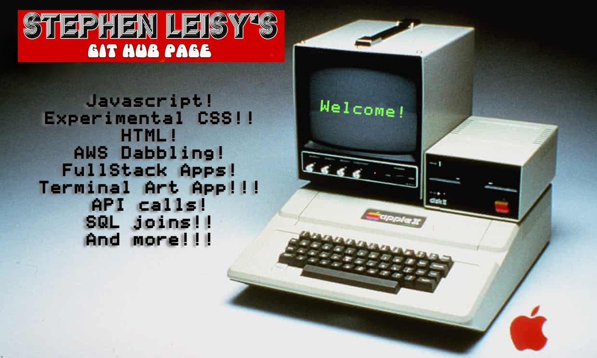

<h1 align='center'></h1>

Hi there, I'm Stephen! I’m a full-stack software engineer, though I have a bit of preference toward front end development. Im also a musician and DIY recording engineer who spent my twenties and early thirties working a cocktail focused bar job in between tours. I spend maybe too much time thinking about vibe in all of these activities, but aesthetics and vibe are so near to my heart I carry them with me to every web development project. I love learning new things everyday, which is great because there's no shortage of new concepts in tech. I'd love to work with an inspiring, diverse team to expand my skills and build some real beautiful web applications.

<!--
**stephen-leisy/stephen-leisy** is a ✨ _special_ ✨ repository because its `README.md` (this file) appears on your GitHub profile.

Here are some ideas to get you started:

- 🔭 I’m currently working on ...
- 🌱 I’m currently learning ...
- 👯 I’m looking to collaborate on ...
- 🤔 I’m looking for help with ...
- 💬 Ask me about ...
- 📫 How to reach me: ...
- 😄 Pronouns: ...
- ⚡ Fun fact: ...
-->
